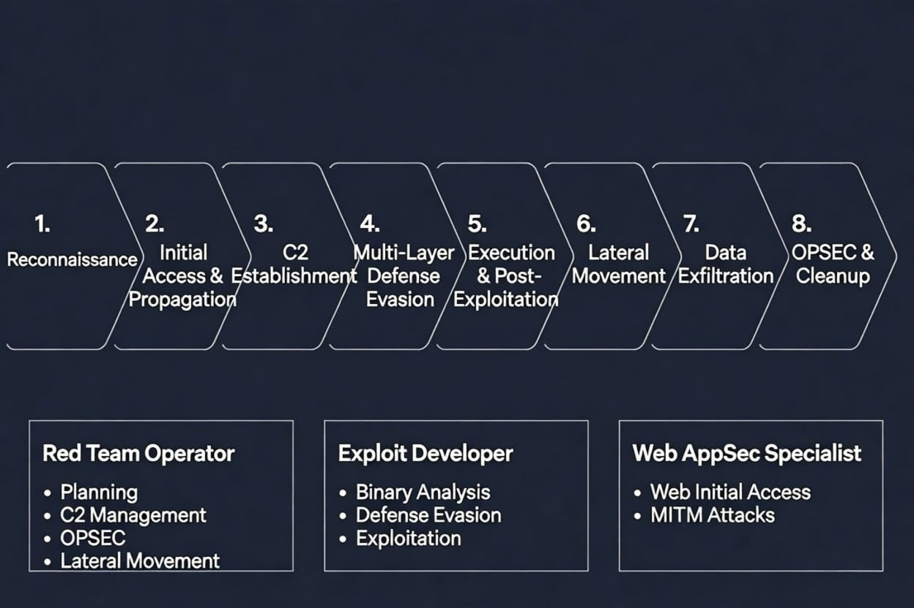

# Red Team Kill Chain - Visual Overview

This diagram shows the complete 8-phase framework and how different roles contribute.

## Role Responsibilities

### Red Team Operator
- Planning
- C2 Management
- OPSEC
- Lateral Movement

### Exploit Developer
- Binary Analysis
- Defense Evasion
- Exploitation

### Web AppSec Specialist
- Web Initial Access
- MITM Attacks
